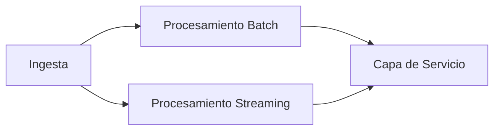

# ¿Qué es la Arquitectura Lambda?

1. [Capa de Ingesta](#1--capa-de-ingesta-o-de-consumo-de-datos)
2. [Capa Batch](#2--capa-batch)
3. [Capa de Streaming](#3--capa-de-streaming-o-speed-layer)
4. [Capa de Servicio](#4--capa-de-servicio-o-serving-layer)

La arquitectura lambda es un framework de diseño para procesar big data que usa de forma simultánea flujos de datos en streaming y en batch. El procesamiento en streaming consiste en procesar y analizar los datos al vuelo sin persistirlos en capas de almacenamiento. El procesamiento batch, por otro lado, procesa los datos de manera periódica una vez que han sido persistidos en bases de datos o en el data warehouse.

La arquitectura lambda se puede usar para reducir las latencias, escalar la solución y aumentar la tolerancia a fallos para procesar simultáneamente flujos de datos batch y streaming.

Como hemos visto, este diseño de arquitectura tiene dos pipelines de datos diferenciadas:

- Pipeline de procesamiento **Batch**
- Pipeline de procesamiento en **Streaming**

Ambas pipelines se ejecutan de forma distribuida y ayudan a analizar los datos y extraer métricas y vistas para tomar decisiones de negocio informadas. El caso de uso más común es la recolección de eventos que se añaden a los datos existentes, de los que se determina el estado.

El modelo se ideó originalmente con 4 capas principales:

---

### 1 | Capa de Ingesta o de Consumo de datos

Esta capa es la responsable de obtener los datos de las fuentes. Las tecnologías más populares aquí son **Apache Kafka**, **Apache NiFi** o **Flume**. La recolección de datos puede suceder en modo batch o en streaming. Esto afectará a las tecnologías que serán necesarias en el resto de la pipeline de datos. Las fuentes de datos usadas se pueden añadir o eliminar según las demandas y necesidades del proyecto.

### 2 | Capa Batch

En el caso del flujo batch, la herramienta de ingesta acumula los datos en un almacenamiento persistente antes de realizar un procesamiento. Es común que esta capa de almacenamiento sea distribuida como lo es **HDFS**, también con tolerancia a fallos y replicación. El procesamiento se puede realizar de una forma distribuida como **Spark** o con bases de datos relacionales y nosql como **Snowflake** o Synapse Analytics.

La capa batch tiene disponible todos los datasets persistidos en el sistema, puede ejecutar procesos de consolidación y actualizar las vistas con los datos más recientes.

### 3 | Capa de Streaming o Speed Layer

La capa de streaming o speed layer procesa los datos sin necesidad de persistirlos. El propósito de esta capa es reducir los intervalos de tiempo que la capa Batch no es capaz de procesar. Por lo tanto, permite que los datos estén disponibles en el menor tiempo posible, aunque para ello se deba sacrificar algo de precisión. Las tecnologías que se usan para realizar esta tarea pueden ser **Spark Streaming**, **Flink** o **Kafka Streams**.

Cada evento recibido puede desencadenar este procesamiento y un cambio en las vistas y tablas asociadas, de forma que se tenga una visión en tiempo real. Los resultados se almacenan en bases de datos NoSQL que reducen la latencia.

### 4 | Capa de servicio o Serving Layer

La última capa de la arquitectura es la de servicio. Es la encargada de combinar los resultados de las pipelines batch y de streaming para tener una vista unificada de los resultados. Las actualizaciones de streaming se producen en tiempo real y las actualizaciones de la capa batch de manera periódica.

La capa de servicio da respuesta a las consultas específicas sobre los datos preprocesados. Algunas tecnologías adecuadas para realizar esta tarea son **Apache Druid**, **Apache Impala**, **Apache Hive**, **Cosmos DB** o **Elasticsearch**.

[Inicio](#¿qué-es-la-arquitectura-lambda)